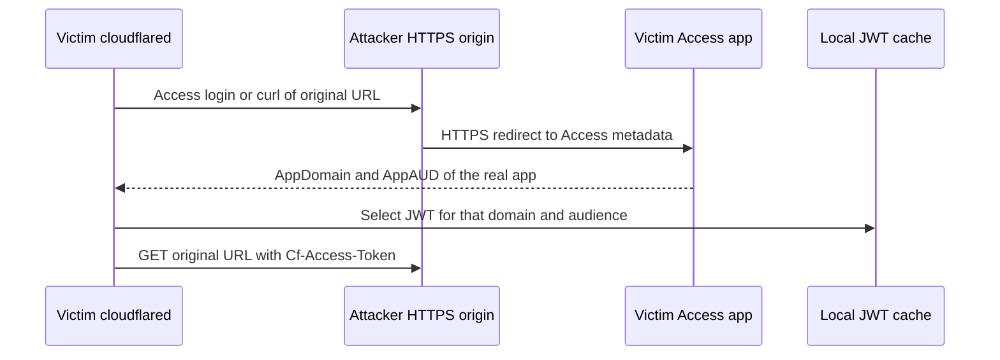
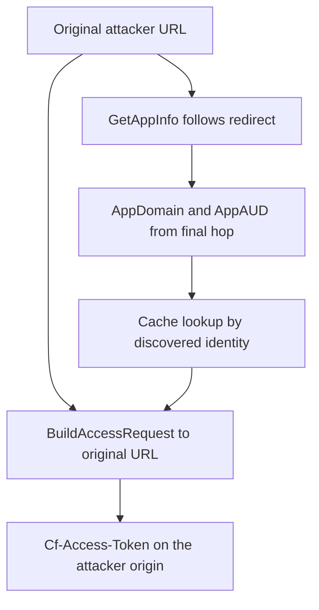

## What I found

In cloudflared 2026.7.3 (`3a2b45c2a511fcdd81b68c190938e4ffadbea5dc`), Access metadata discovery can follow an HTTPS redirect to a **different** application. The redirect-derived `AppDomain` and `AppAUD` select that application's cached JWT. The request builder then creates a **new** request to the original URL and puts that JWT in `Cf-Access-Token`.

A remote attacker who controls a valid HTTPS origin can therefore induce a user with a non-expired token for another Access application to run a supported Access workflow and deliver that token to the attacker origin.

The failed invariant: a credential chosen by application domain and audience must only be sent to an authority that owns that namespace.

## How it fails

1. `cmd/cloudflared/access/cmd.go` takes the original URL (login / curl) and calls `token.GetAppInfo`.
2. `GetAppInfo` follows a cross-host redirect and returns `AppDomain` / `AppAUD` from the **final** Access response, without checking they still match the original authority.
3. `verifyTokenAtEdge` stuffs that discovered `AppInfo` plus the original URL into `carrier.StartOptions`.
4. `carrier.BuildAccessRequest` calls `token.FetchTokenWithRedirect` with the original URL and the discovered metadata.
5. On the valid-cache fast path, `GetAppTokenIfExists` / `GenerateAppTokenFilePathFromURL` pick a cache file **only** from discovered `AppDomain` and `AppAUD`.
6. `BuildAccessRequest` builds a GET to the original URL and adds `Cf-Access-Token`, with no compare of destination authority against discovered domain, audience, or issuer.
7. `isTokenValid` sends it. The same constructor is used from `carrier/websocket.go` for authenticated carrier handshakes.

CWE-923: the TLS peer is authenticated, but cloudflared does not check that this peer is the intended recipient of the selected application credential. CWE-601 is the redirect; the sink is the credential send.

## Attack shape

1. The victim already has a valid cached JWT for a protected Access application.
2. The attacker runs a normal HTTPS endpoint and gives the victim an Access URL for it.
3. During HEAD discovery, that endpoint redirects to the victim application's Access metadata.
4. cloudflared treats the redirect response as the application identity and loads that JWT.
5. It then sends the credential-bearing request to the **original** attacker URL.
6. The attacker captures the bearer and may replay it against the scoped application until expiry, subject to any token-binding policy.

No local access, Cloudflare edge privilege, tenant control, unsafe flag, service-token header, or TLS bypass is required. Certificate validation stays on.

## Impact

The victim loses confidentiality of one non-expired, application-scoped Access JWT. The attacker receives that exact cached bearer on the trigger request.

Controls: a legitimate origin and an attacker-own-metadata origin deliver **zero** victim tokens. Cache deletion on invalid-response branches cannot unsay a token already sent.

Not claimed: successful replay in a production tenant, binding-cookie bypass, cross-tenant admin, RCE, or privilege escalation. Blast radius is one selected application, the token lifetime, and any binding policy. User interaction plus a pre-existing cached token bound the window; they do not make the leak acceptable.

## Fix

Bind cache selection and credential attachment to the request's destination authority. Either:

- refuse to use discovery metadata whose host differs from the original URL, or
- send the selected JWT only to a host that matches `AppDomain` / token audience.

Do not attach `Cf-Access-Token` to a rebuilt request whose authority is not the application that owns the cache file.

## What this is not

Not “the user clicked a link, so any token send is expected.” Access JWTs are application-scoped; a redirect must not retarget them. Distinct from organization-token redirect-cookie mutation and management log-token disclosure: those have different objects and sinks. This is the mismatch between **who selected the cache file** and **who receives the HTTP credential**.
