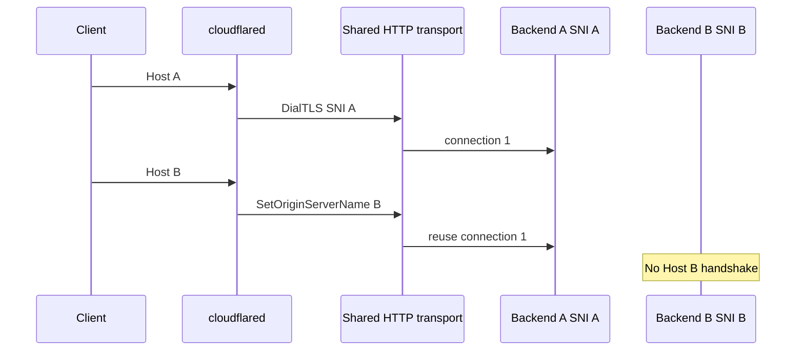
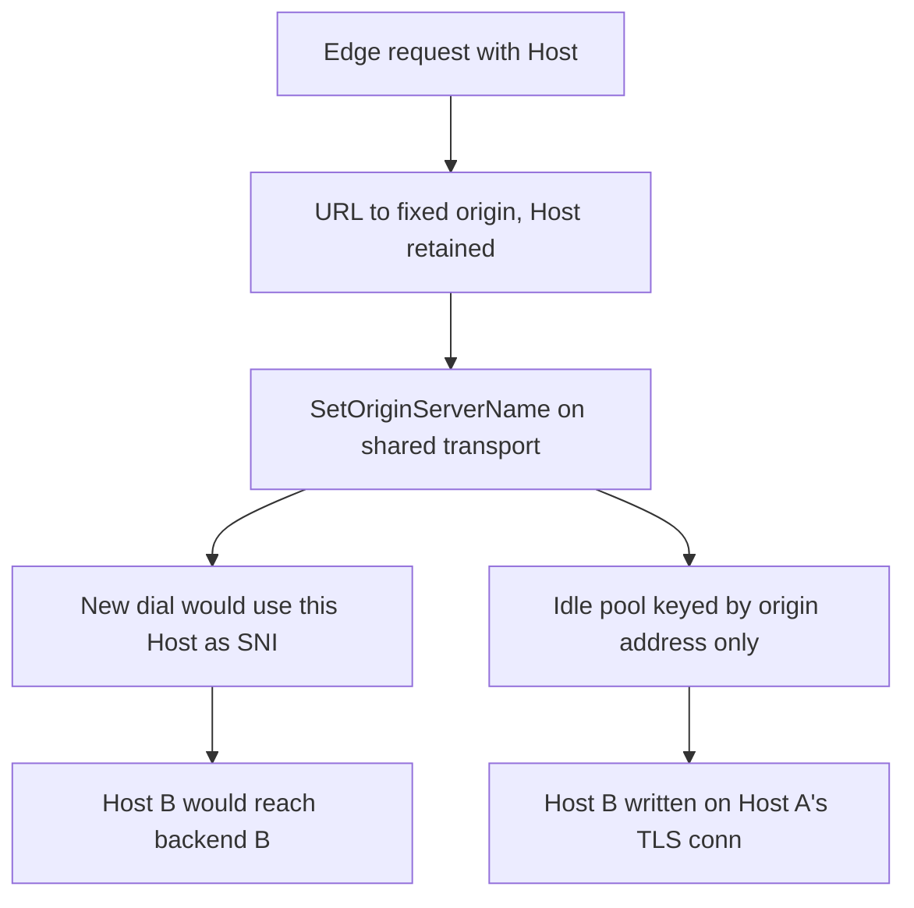

## What I found

In cloudflared 2026.7.3 (`3a2b45c2a511fcdd81b68c190938e4ffadbea5dc`), a wildcard ingress rule can point several hostnames at one fixed HTTPS/WSS origin with `matchSNItoHost: true`. For each request, cloudflared replaces `DialTLSContext` on a **shared** HTTP transport so a *new* dial would use the current Host as TLS SNI.

`net/http.Transport` may instead reuse an idle TLS connection keyed by the **fixed origin address**. That path does not call the new dial callback and does not include SNI in the pool identity. A later Host B request is written on the connection that was authenticated and SNI-routed for Host A.

The failed invariant: a request that uses dynamic SNI must travel only on a TLS connection authenticated and SNI-routed for that request's effective Host.



## How it fails

Supported topology, all of:

- a fixed HTTPS or WSS origin address
- `matchSNItoHost: true`
- no fixed `httpHostHeader`
- an SNI-selecting origin entry point
- persistent HTTP/1.1 (keep-alive is default)

Path:

1. Edge HTTP delivers Host. `proxyHTTPRequest` selects the HTTP origin proxy.
2. `httpService.RoundTrip` rewrites the URL to the fixed origin, keeps request Host, calls `SetOriginServerName`.
3. `SetOriginServerName` replaces the shared transport's `DialTLSContext` so the **next** dial uses this Host as `ServerName`.
4. `Transport.RoundTrip` may pick an idle conn for the fixed origin scheme/address instead. No new handshake. Host B bytes go to backend A; backend A's response goes back to the Host B client.

CWE-923. Sequential reuse is enough; no concurrent callback race is required. Certificate verification can stay enabled. This is not “Go Transport is buggy in isolation”: cloudflared mutates per-request identity on a pool that does not key that identity.



## Attack shape

1. Operator deploys the shared-entry-point config for two hostnames (e.g. `a.example.test`, `b.example.test`).
2. A remote client requests Host A. cloudflared opens TLS connection 1 with SNI A; the origin routes it to backend A.
3. While that conn is idle (default idle timeout 90s), the client sends Host B with sensitive headers or body.
4. cloudflared reuses connection 1. Backend A sees Host B's request. Backend A's response is returned as Host B's response.

No config access, edge compromise, connector compromise, or TLS bypass. The reviewed proof sent a Host B marker to backend A on connection 1; forcing a fresh connection sent the same Host B request to backend B on connection 2.

## Impact

Host B request paths, headers, authorization material, and bodies can reach backend A. Response integrity is also gone: the Host B client may receive backend A's output.

```text
vulnerable:   Host B request -> backend A
fresh TLS:    Host B request -> backend B
```

Limited to hostnames that share the affected rule and fixed origin transport. The attacker can re-prime the idle conn. Restart or idle timeout clears a pooled socket; it does not fix the pool key.

Not affected (bounded, not a reason the multi-host topology is fine): single hostname, fixed `httpHostHeader`, reuse disabled, origin that ignores SNI.

## Fix

Partition the origin connection pool by effective SNI / Host, or disable keep-alive when `matchSNItoHost` is on. Updating `DialTLSContext` is not enough: idle conns never see that callback.

A request for Host B must not be written on a TLS session whose ClientHello SNI was Host A.

## What this is not

Not “the operator chose a shared origin, so mixing backends is intended.” `matchSNItoHost` exists so a shared TLS entry point still selects the **matching** origin per hostname. Not an insecure TLS setting. Distinct from a concurrent dial-callback race; the sequential idle-reuse path is sufficient.
