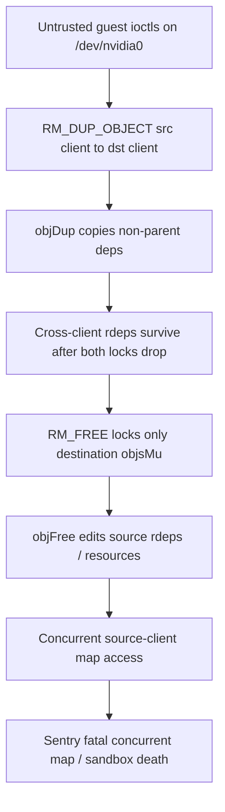
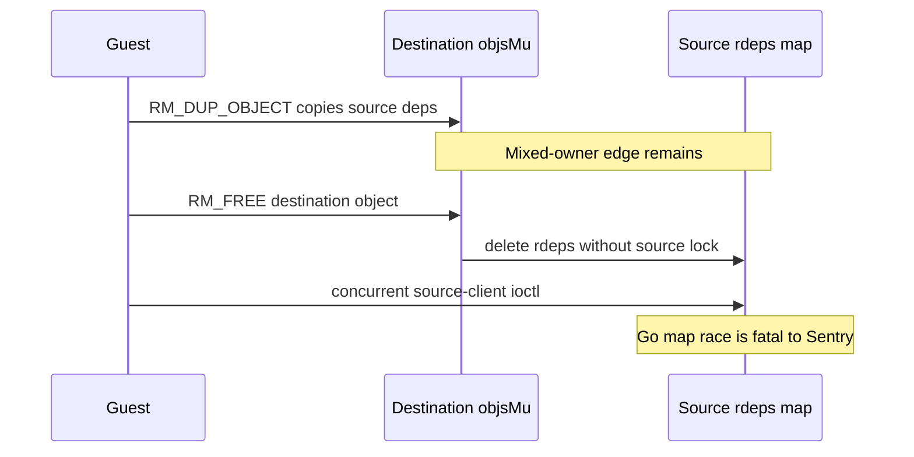

## What I found

gVisor’s NVIDIA proxy (`nvproxy`) mirrors host-driver GPU object lifetimes in Sentry-managed Go maps. A guest can `NV_ESC_RM_DUP_OBJECT` a dependency-bearing object from one root client into another. `objDup()` records the duplicate in the destination client but **copies non-parent dependency edges that still point at source-owned objects**.

`NV_ESC_RM_FREE` then locks only the client named by `HRoot` while tearing down that mixed-owner graph. Freeing the duplicate mutates source-owned reverse-dependency maps without the source lock. A concurrent guest thread on the source client hits Go’s fatal concurrent-map checks and kills the trusted Sentry — taking the whole sandbox with it.

This is guest-to-host denial of service across the sandbox boundary, not a host RCE. It needs a GPU-enabled `runsc` deployment with nvproxy exposing `/dev/nvidia0`.



## How the lock domain and the graph disagree

`objDep()` documents that **both** clients’ `objsMu` locks must be held for a cross-client edge. `rmDupObject()` does that while creating the duplicate. The copied edge outlives that critical section.

`rmFree()` later calls `objFree()` with only the initiating client’s lock. `objFree()` / `prependFreedLockedRecursive` walk `rdeps` and `delete` from `o2.client.resources` and `o3.rdeps` without checking `o2.client == client`.

```go
// Precondition: clientDst.objsMu and clientSrc.objsMu must be locked.
func (nvp *nvproxy) objDup(... clientDst, clientSrc *rootClient, ...) {
    // Copy all non-parent dependencies.
    for dep := range oSrc.deps {
        if dep != parentSrc {
            objDep(oDst.Object(), dep) // dep may still belong to clientSrc
        }
    }
}

// Precondition: client.objsMu must be locked.  // only the freed client
func (nvp *nvproxy) objFree(...) {
    for o3 := range o2.deps {
        delete(o3.rdeps, o2) // o3 may be source-owned
    }
    delete(o2.client.resources, o2.handle)
}
```

The missing invariant: every object reachable through the free graph must belong to the initiating client, or its owning client must be locked before any map mutation.

The race became security-relevant when nvproxy moved from a global object lock to per-root-client mutexes (`b5f9bed9`, 2025-03-26) but left cross-client dependency edges and a single-client `objFree()`. DUP_OBJECT tracking itself landed earlier (`a55b3b2d`).



## Attack shape

1. Inside a GPU-enabled gVisor sandbox, open `/dev/nvidia0`. No host privilege.
2. Create two root clients and a dependency-bearing source object (virtual memory, context-DMA, channel, and similar paths attach extra deps).
3. Duplicate that object from source into destination with `NV_ESC_RM_DUP_OBJECT`.
4. Race `RM_FREE` of the destination handle against ioctls on the source client.

`NV_ESC_RM_DUP_OBJECT` and `NV_ESC_RM_FREE` are both allowed under normal nvproxy seccomp/`compUtil` policy. The hardware-free proof is `TestCrossClientDupFreeRace` under `go test -race` / Bazel `--config=race`; the race detector flags `object.go` `delete(o3.rdeps, o2)` with the destination lock held and the source map owned by another client.

## Impact

CVSS 3.1 **High** (`AV:L/AC:L/PR:N/UI:N/S:U/C:N/I:L/A:H`, 7.1). Primary effect is availability: Sentry process death tears down the sandbox. Secondary risk is desynchronizing nvproxy’s mirrored handles from the host driver.

Conditional on NVIDIA GPU support, nvproxy frontend exposure, and a host-accepted dependency-bearing duplicate. Not a confidentiality break, not host kernel RCE, and not a claim against CPU-only sandboxes.

## Fix

Lock every root client reachable from the free graph before mutating any object maps, in a stable handle order so two frees cannot deadlock. Alternatives: reject `NV_ESC_RM_DUP_OBJECT` on dependency-bearing objects, or refuse to copy a dep whose `client != clientDst` at duplicate time.

After a fix, guest stressors may still see ordinary NVIDIA status errors for stale handles. Sentry must not panic, and nvproxy must not mutate another client’s maps without that client’s lock.

## What this is not

Not a host escape. Not a requirement for a compromised host driver. Not “the guest already has code execution, so a Sentry crash is in-scope noise” — the Sentry is the trusted TCB for the sandbox, and a guest ioctl sequence should not be able to `fatal error: concurrent map` it. Distinct from a global `objsMu` design; the per-client lock change is what made the leftover cross-client edges a race.
