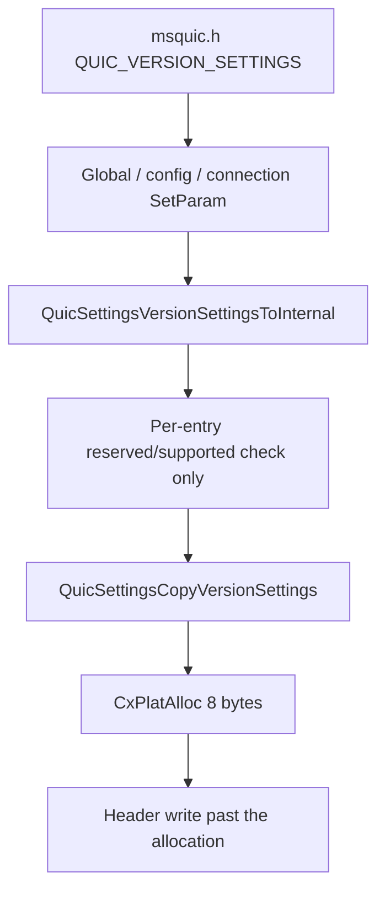

## What I found

On the officially supported Linux ARM32 ABI (`sizeof(size_t) == 4`), `QuicSettingsCopyVersionSettings` wraps an allocation size to 8 bytes and then writes using the original `uint32_t` counts. The public converter `QuicSettingsVersionSettingsToInternal` reaches that helper with valid reserved-version input.

This is a deterministic library-owned heap overflow. It stays Medium: the caller already lives in the embedding process and already holds the MsQuic API table. It is not a remotely reachable packet bug.


## The arithmetic

`QUIC_VERSION_SETTINGS` carries three pointers and three independent `uint32_t` counts. The copy helper computes:

```c
size_t AllocSize =
    sizeof(*Destination) +
    (Source->AcceptableVersionsLength * sizeof(uint32_t)) +
    (Source->OfferedVersionsLength * sizeof(uint32_t)) +
    (Source->FullyDeployedVersionsLength * sizeof(uint32_t));
```

With `N = 0x15555554` on all three lists:

```text
sizeof(QUIC_VERSION_SETTINGS) = 24
N × 4                         = 0x55555550
required                      = 24 + 3 × 0x55555550
                              = 0x100000008
ARM32 size_t                  = 8
```

The helper allocates 8 bytes, stores the header, then walks the original counts. The first invalid write is a 4-byte store four bytes past the 8-byte region. The same aggregate does not wrap on 64-bit `size_t`.

The PoC uses reserved version `0x0a0a0a0a`, which `QuicIsVersionReserved` accepts, so the public validator does not reject the input for version validity. All three pointers alias one large read-only mapping of that value.



## Why it is Medium, not High

- The least-privileged actor already has in-process execution and the API table.
- MsQuic has no privilege boundary above the embedding application.
- The API is preview-gated and the wrap is ARM32-specific.
- The trigger needs about 1.33 GiB of readable input and on the order of a billion validation iterations.
- Evidence is corruption / abort, not reliable code execution and not a cross-process effect.

Those constraints do not make unchecked library arithmetic an expected behavior of a typed API.

## Impact

| Quantity | Value |
| --- | --- |
| Required representation | 4,294,967,304 bytes |
| Requested allocation | 8 bytes |
| Underallocation | 4,294,967,296 bytes |
| First observed fault | 4-byte write, 4 bytes past an 8-byte region |

The public converter run shows this is not an unreachable internal helper. A caller can feed valid reserved versions through the documented route and hit the same allocator.

## Fix

Check representability before allocate-and-copy: reject if any length multiply or the three-list sum does not fit in `size_t`, and reject lengths that cannot be encoded on the wire. The 64-bit path should use the same checked arithmetic so the ABI does not silently diverge.

## What this is not

Not a remote DoS. Not a claim of RCE, privilege escalation, or impact outside the caller’s process. Not “only the internal copy helper is wrong” — the public converter is on the path.
