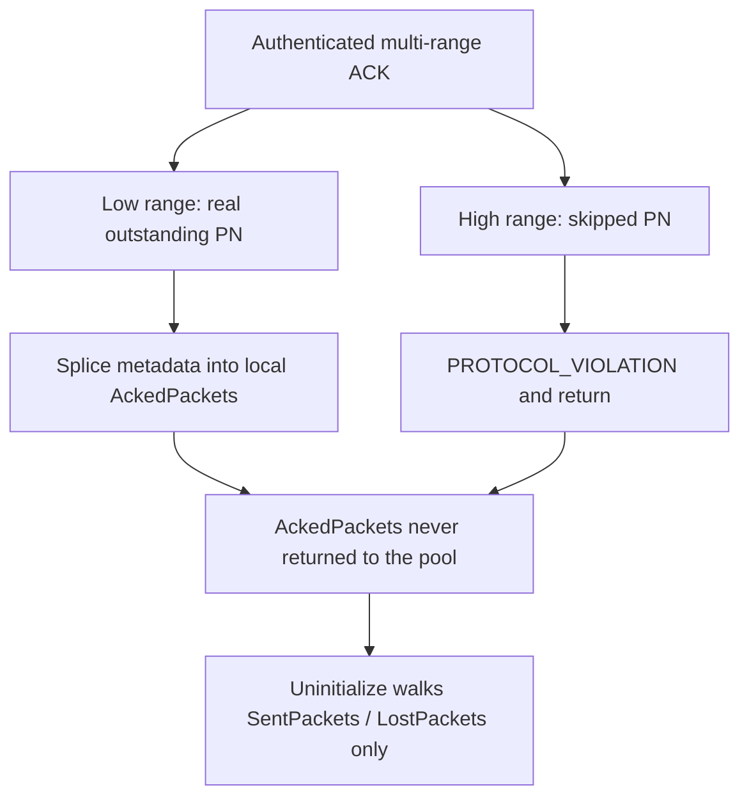
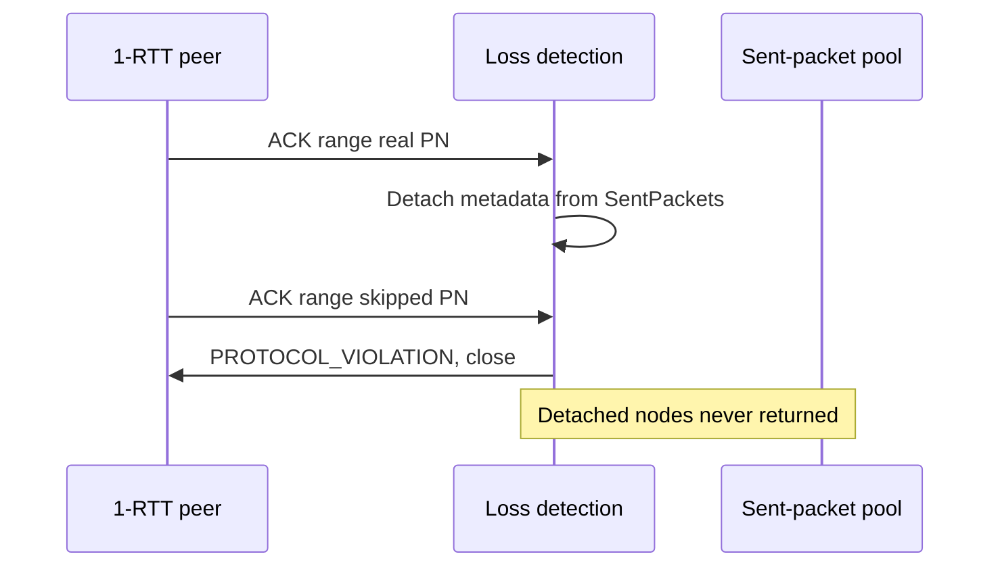

## What I found

MsQuic walks decoded ACK ranges from low packet number to high. A syntactically valid multi-range ACK can acknowledge a real outstanding packet in a lower range, then include a deliberately skipped packet number in a later range.

The later range correctly raises `PROTOCOL_VIOLATION`. The early return skips completion and pool-return of metadata that the lower range already spliced off the connection-owned lists. Shutdown cannot find those nodes. Repeating the sequence across connections retains process memory.

This is a medium-severity authenticated remote DoS. Closing the attacker’s connection does not reclaim the leak.

## The ownership bug

`QuicConnRecvFrames` accepts the ACK. Ranges are stored low-to-high in `DecodedAckRanges`. `QuicLossDetectionProcessAckBlocks` iterates that order.

The skipped-packet check runs **inside** the same loop that mutates ownership. For the lower real range, matching nodes move from `SentPackets` / `LostPackets` onto a stack-local `AckedPackets` list. When a later range covers `Connection->Send.SkippedPacketNumber`, the function calls `QuicConnTransportError(..., QUIC_ERROR_PROTOCOL_VIOLATION)` and returns.

The return sits before the loop that completes acknowledgements and returns metadata to the pool. `QuicLossDetectionUninitialize` only walks the member lists. Frame-owned stream or datagram references on those nodes stay held too.

The failed invariant: a rejecting validation must dominate ownership changes, or the error path must release every node already detached.

## Attack shape

1. Complete a normal QUIC/TLS handshake.
2. Pace responses so at least one lower sent or lost packet stays outstanding while the server sends across a scheduled packet-number skip.
3. Send a valid encrypted ACK whose low range covers the real packet and whose later range covers the skipped number.
4. The connection closes. The detached allocation remains in the shared process.
5. Open a fresh connection and repeat.

QUIC packet numbers and keys are per-connection, so a second independent client cannot ACK the first connection’s packets. One authenticated peer is the whole attacker.

A positive E2E run against an unmodified server retained one 120-byte metadata allocation: gets 81 / returns 80 after shutdown, versus a balanced no-attack control.

## Impact

Retained memory after N triggers is the sum of each detached metadata allocation plus up to 12 frame references per packet. Per connection the yield is bounded by outstanding sent/lost state. Across attacker-created connections it accumulates until process restart.

No reviewed path gives an OOB, write primitive, control-flow influence, or privilege-boundary cross. RCE and confidentiality/integrity impact are not supported. The cost of a completed handshake plus enough server output to cross a skip is why this stays Medium.

## Fix

Validate every ACK range, including skipped-PN rejection, **before** splicing metadata — or on the error path walk `AckedPackets` and return every node. Treating an ACK of an unsent packet as a protocol violation is correct (RFC 9000). The defect is the non-transactional placement of that check.

## What this is not

Not “rejecting a skipped PN is the bug.” That rejection is intentional. The bug is leaking the earlier range’s detached objects when the later range fails. Connection close is not cleanup for process-lifetime pool nodes.
