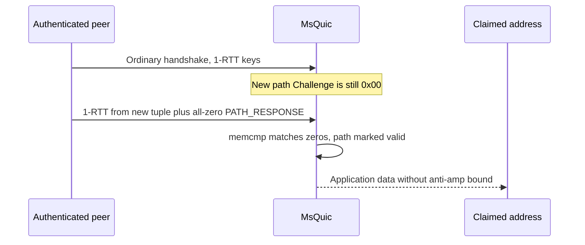
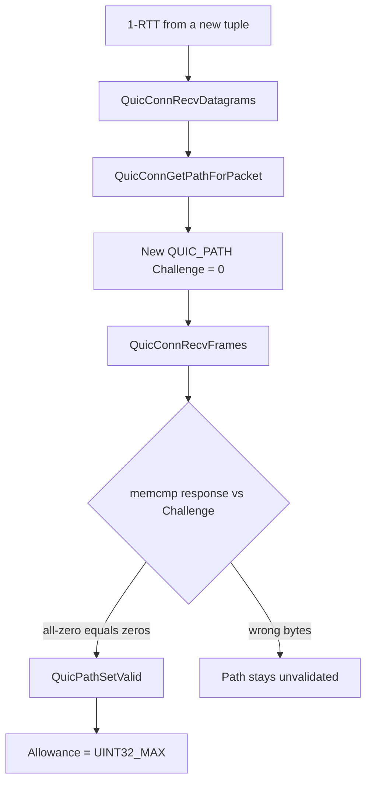

## What I found

MsQuic accepts a `PATH_RESPONSE` with a raw byte compare. A newly created path has zeroed challenge storage. That means an authenticated peer can send an all-zero `PATH_RESPONSE` from a claimed migration tuple **before** the stack has ever generated a `PATH_CHALLENGE`.

The path is marked peer-validated. Anti-amplification allowance jumps from a few dozen bytes to `UINT32_MAX`. RFC 9000 requires the response to echo data from a challenge that was actually sent. This matcher never checks that a challenge exists.



## How the state machine fails

A 1-RTT packet from a new source tuple goes through `QuicConnRecvDatagrams` → `QuicConnGetPathForPacket`. `QuicPathInitialize` leaves `Challenge`, `SendChallenge`, and `PathValidationStartTime` at zero.

Authenticated frame processing then does:

```c
if (!TempPath->IsPeerValidated &&
    !memcmp(Frame.Data, TempPath->Challenge, sizeof(Frame.Data))) {
    QuicPathSetValid(Connection, TempPath, QUIC_PATH_VALID_PATH_RESPONSE);
}
```

There is no “validation has started” predicate. `PathValidationStartTime != 0` is already used later, when the challenge is actually scheduled. Eight zero bytes compare equal to eight zero bytes, so `QuicPathSetValid` fires and the path allowance becomes `UINT32_MAX`.



## Attack shape

1. Complete a normal QUIC handshake and hold 1-RTT keys.
2. Send a fresh protected packet from a claimed new address and port.
3. Include an all-zero `PATH_RESPONSE` before the server starts validation for that tuple.
4. Optionally include a non-probing frame such as `PING` so the now-validated path becomes the migration target.

No operator privilege or unsafe configuration is required. The attacker must already be an authenticated peer and must be able to spoof a source tuple. Those bounds limit volume; they do not restore return-routability.

## Impact

The protected control is the new-path send limit:

```text
min(queued application bytes, congestion/loss limits, 3 × bytes received on the unverified address)
```

After the premature validation it becomes:

```text
min(queued application bytes, congestion/loss limits, UINT32_MAX)
```

Target-native accounting showed `validated=1 allowance=4294967295` for the all-zero pre-challenge response, versus `validated=0 allowance=27` for the wrong-response control. Ten 1,200-byte send records were accepted against a secure 27-byte maximum.

This is a third-party reflection / DoS primitive, not a crash and not RCE. Actual reflected volume still depends on queued application data, congestion control, MTU, and spoofing — none of which replaces proof that the peer owns the claimed address.

## Fix

Reject a `PATH_RESPONSE` unless validation is outstanding. The existing lifecycle flag is enough:

```c
if (!TempPath->IsPeerValidated &&
    TempPath->PathValidationStartTime != 0 &&
    !memcmp(Frame.Data, TempPath->Challenge, sizeof(Frame.Data))) {
    QuicPathSetValid(Connection, TempPath, QUIC_PATH_VALID_PATH_RESPONSE);
}
```

That preserves a legitimate in-flight challenge/response and closes the zero-initialized window.

## What this is not

Not 0-RTT. Not a TLS-provider bug. Not a design choice to trust authenticated peers with unvalidated addresses — RFC 9000 §8.2.3 and §9.3.1 still require the challenge to have been sent. Congestion control is not a substitute for path validation.
