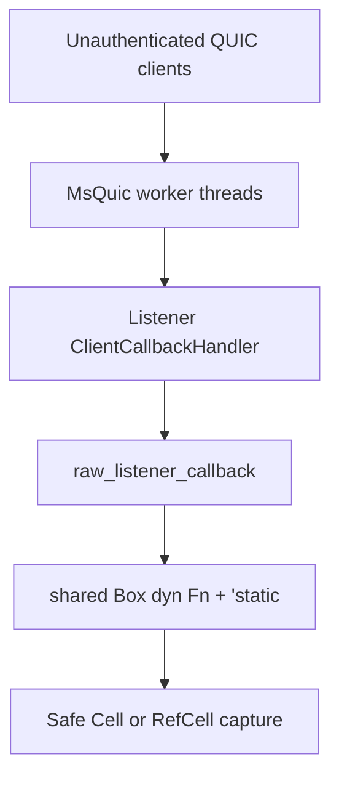
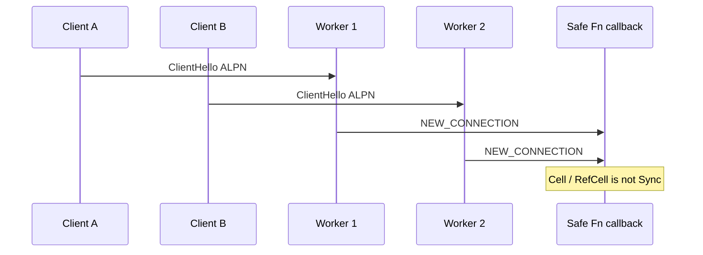

## What I found

MsQuic’s in-tree Rust crate exposes `Listener::open` as a safe API. The handler type is `Fn(...) + 'static`. Native worker threads can invoke that **one** callback concurrently. A Rust `Fn` is not necessarily `Sync`.

An unauthenticated peer that can complete ordinary handshakes against a public listener can therefore race safe captured state. This is a High-severity MSRC-candidate class: remote process DoS and safe-Rust memory unsafety. It is not a demonstrated RCE.



## How the wrapper lies to the type system

The public type is:

```rust
pub type ListenerCallback = dyn Fn(ListenerRef, ListenerEvent) -> Result<(), Status> + 'static;
```

`Listener::open` boxes the handler and hands it to native code as opaque context. The trampoline recovers a shared reference and calls it:

```rust
match unsafe { (context as *mut Box<ListenerCallback>).as_ref() } {
    Some(f) => match f(listner_ref, event) { /* ... */ }
    None => StatusCode::QUIC_STATUS_SUCCESS.into(),
}
```

The native path does not serialize those calls. A valid ClientHello reaches `QuicCryptoProcessData` → `QuicBindingAcceptConnection` → `QuicListenerIndicateEvent`, which calls `Listener->ClientCallbackHandler` directly. `StartRefCount` keeps the listener alive; it is not a mutex. Project docs state that new-connection listener callbacks run in parallel.

Sharing `&F` across threads requires `F: Sync`. The public API never asks for it.



## Attack shape

1. A Rust server opens a UDP listener with `Listener::open` and captures ordinary safe state such as `Cell<usize>`.
2. An unauthenticated peer opens many overlapping valid connections with the listener’s ALPN.
3. Multiple native workers accept and invoke the same boxed callback.
4. The closure races the captured cell. A `RefCell<Vec<u8>>` variant aborts the process (`RefCell already borrowed`, exit 134) after the panic crosses the C ABI.

Loopback is only a transport fixture. The sink is the same public UDP listener dispatch that wire handshakes reach.

## Impact

Reviewed numbers on the pinned commit:

| Scenario | max_active | Observed | Serial expectation |
| --- | ---: | ---: | ---: |
| One client | 1 | `cell_final=100000` | 100000 |
| 64 clients | 4 native threads | `cell_final=2239247` over 57 callbacks | 5700000 |

The one-client control is serialized. The storm is not. The compiler accepted the closure as safe.

Demonstrated: data-race unsafety in safe Rust, and deterministic process abort via `RefCell`. Not demonstrated: OOB write, UAF, arbitrary write, disclosure, code execution, or auth bypass. Those are non-claims, not upgrades inferred from the words “undefined behavior.”

Bounty eligibility against a Microsoft-owned service is a separate question from the repository defect. The technical category stands either way.

## Fix

Require the auto-traits the runtime already assumes:

```rust
pub type ListenerCallback =
    dyn Fn(ListenerRef, ListenerEvent) -> Result<(), Status> + Send + Sync + 'static;
```

And the same bounds on `Listener::open`. Applications that need interior mutability then use `Mutex` / atomics, which is the contract the native workers already have.

## What this is not

Not “the app chose to capture `Cell`.” The library documents parallel callbacks and still types the API as safe `Fn`. `Fn` is an immutable receiver, not `Sync`. Network peers choose the connection timing; this is not a local self-attack.
