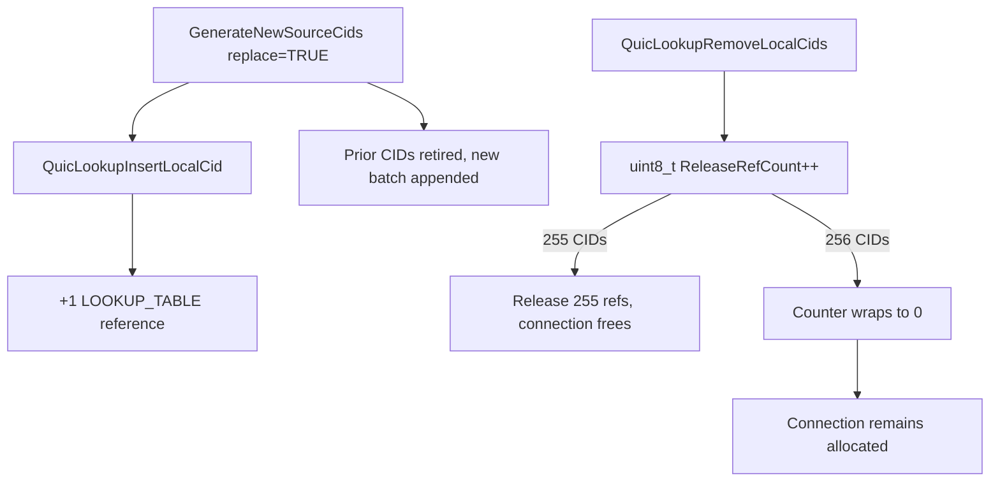

## What I found

MsQuic takes one `QUIC_CONN_REF_LOOKUP_TABLE` reference for every source CID published in the lookup table. Replacement generation appends a new batch and does not cap the aggregate list, so the published count can exceed 255.

Shutdown walks the list with `uint8_t ReleaseRefCount`. At 256 lookup-published CIDs the counter wraps to zero. CID entries are still removed and freed; the matching connection references are not released. `QuicConnFree` wants `RefCount == 0`, so the connection stays allocated after shutdown.

Target-native tests confirm the cleanup defect at 255 / 256 / 257. A two-byte counter removes it. The full remote 256-CID sequence was not landed as a clean E2E, so this is Medium remote resource retention, not the earlier High rating.



## The counter

```c
uint8_t ReleaseRefCount = 0;

while (Connection->SourceCids.Next != NULL) {
    /* pop CID, drop from lookup, free the hash entry */
    if (CID->CID.IsInLookupTable) {
        QuicLookupRemoveLocalCidInt(Lookup, CID);
        ReleaseRefCount++;
    }
}

for (uint8_t i = 0; i < ReleaseRefCount; i++) {
    QuicConnRelease(Connection, QUIC_CONN_REF_LOOKUP_TABLE);
}
```

At 256 entries, `ReleaseRefCount++` goes 255 → 0. The removal loop still empties the list and `CidCount`. The release loop runs zero times.

`SourceCidLimit` is a per-batch limit, not an aggregate cap on `Connection->SourceCids`. Replacement mode marks existing CIDs retired and appends another batch.


## Attack shape

1. Complete an ordinary handshake. No application or host privilege is required.
2. Send valid 1-RTT packets from changing source tuples so they land on different partitions. That path sets `UpdatePartitionId` and regenerates source CIDs.
3. Ignore `RETIRE_CONNECTION_ID` and keep the server-issued CIDs. With a four-CID batch, on the order of 64 replacement events publish 256 CIDs.
4. Let the connection shut down. Cleanup removes entries and releases zero lookup refs at the 256 boundary.
5. Repeat to retain terminal connection state.

The first steps, including authenticated source-port migration, were reached. The full 64-event sequence was not accepted as a clean teardown observation, which is why remote impact stays a source-backed Medium rather than a demonstrated High wire exploit.

## Impact

For `P` lookup-published local CIDs, cleanup releases `P modulo 256` references.

| Published CIDs | Lookup entries left | Refs released | Refs retained |
| ---: | ---: | ---: | ---: |
| 255 | 0 | 255 | 0 |
| 256 | 0 | 0 | 256 |
| 257 | 0 | 1 | 256 |

This is availability / resource exhaustion. Cleanup frees the CID entries rather than freeing the connection early, so it is not a UAF. Lookup count goes to zero, so it is not a stale-routing or auth bypass. There is no attacker-controlled write or code pointer.

## Fix

Use a width that can count the list (`uint32_t`), or release one reference per removed lookup CID inside the loop instead of a narrowed counter. An aggregate source-CID cap below 256 would also block this particular wrap; it would not fix the independent 8-bit shutdown counter.

## What this is not

Not “the peer must cooperate, so the counter is a design choice.” The implementation takes one lookup reference per published CID and must release one per removed CID. That invariant does not depend on the peer honoring retirement. Distinct from destination-CID growth and transport-parameter decode leaks.
