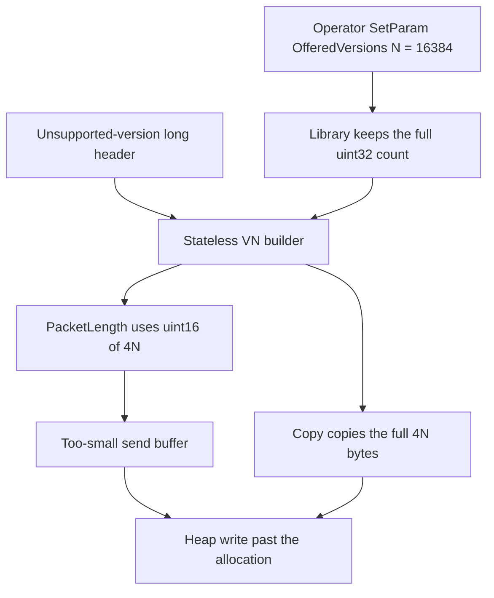
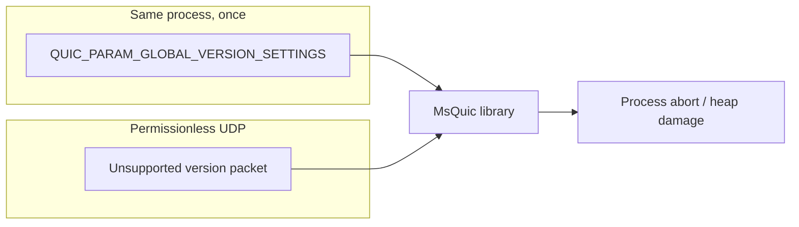

## What I found

MsQuic accepts a global `QUIC_VERSION_SETTINGS` offered-version list with no cap tied to Version Negotiation encoding. After an operator installs a large-but-accepted list, an unauthenticated UDP sender can trigger a VN response.

The builder narrows the offered-list byte count to `uint16_t` for allocation, then copies the full count. On Linux epoll + ASan this is a heap-buffer-overflow and process abort. A normal non-ASan build independently aborted with glibc `double free or corruption (!prev)`. Severity is High, **conditional** on that non-default global configuration.



## How allocation and copy disagree

`QuicLibrarySetParam(QUIC_PARAM_GLOBAL_VERSION_SETTINGS)` calls `QuicSettingsVersionSettingsToInternal`. The validator checks that each version looks supported or reserved. It does **not** bound `OfferedVersionsLength` against VN packet capacity. The 32-bit count is stored as-is.

An unsupported-version packet later hits `QuicBindingProcessStatelessOperation`:

```c
const uint16_t PacketLength =
    sizeof(QUIC_VERSION_NEGOTIATION_PACKET) +
    RecvPacket->SourceCidLen + sizeof(uint8_t) +
    RecvPacket->DestCidLen + sizeof(uint32_t) +
    (uint16_t)(SupportedVersionsLength * sizeof(uint32_t));

CxPlatCopyMemory(Buffer, SupportedVersions,
    SupportedVersionsLength * sizeof(uint32_t));
```

`MAX_VER_NEG_PACKET_LENGTH` only covers the built-in four-entry list. A runtime `OfferedVersions` array is unbounded.

## Attack shape

1. An application installs a 16,384-entry global offered-version array of accepted reserved versions.
2. It runs a normal UDP listener.
3. A remote sender transmits a 1,200-byte long header with version `0xdeadbeef` and two 255-byte CIDs.
4. MsQuic queues a stateless VN. For `N = 16384`, `4N` is 65,536, which narrows to **zero** as `uint16_t`. The copy still writes 65,536 version bytes.

No authentication, session, or established connection is required for the trigger. Installing the list is a deployment precondition, not attacker privilege.



## Impact

For 255-byte CIDs:

```text
actual bytes    = 6 + 255 + 1 + 255 + 4 + 4N
requested bytes = 521 + uint16_t(4N)
```

At `N = 16,384` the version term narrows from 65,536 to 0. The builder writes 66,057 bytes into a 65,507-byte inline buffer: a 550-byte overrun. ASan recorded a 65,536-byte write and exit 134.

This is a pre-authentication heap OOB write with remote process DoS. RCE was not established: on Linux epoll the copy starts in the inline payload after send-context fields, copied values are configured version words, and the non-ASan build aborted in heap cleanup rather than a controlled indirect call. Kernel-mode Windows send pools were not executed in the review environment.

Leaving the runtime list at the four-entry default removes the overflow. The configuration is unusual, which is why this is High rather than Critical.

## Fix

Bound `OfferedVersionsLength` (and the other version arrays) to what a VN packet can actually encode, and compute the send allocation in a wider type with a saturating cap. A four-entry control packet must still produce a normal VN response.

## What this is not

Not “a malicious in-process caller crashing itself.” The library accepts and retains a documented setting. A separate unauthenticated peer then selects the unsafe network path. RFC 9000 VN behavior does not authorize an unbounded alloc/copy mismatch.
