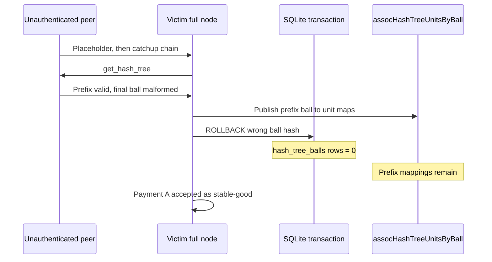
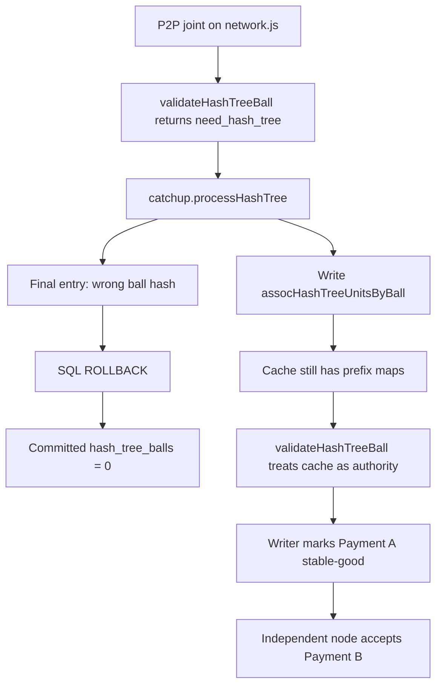

## What I found

Obyte’s full-node catchup path publishes `ball → unit` mappings to a process-global cache **before** the matching SQL transaction commits. An unauthenticated P2P peer can drive the victim into catchup, hand it a witness-authenticated chain, and answer `get_hash_tree` with a segment that has a valid prefix and a malformed final ball.

The node reports `wrong ball hash` and rolls back SQL. The earlier cache entries stay. Later validation treats those leftover mappings as enough authority to accept the attacker’s payment as **stable-good**. A second honest node, with its own database, accepts a conflicting spend of the same genesis output. The victim’s stable-good record survives restart.

This is a consensus / state-integrity failure at the P2P-to-state boundary. It is not an RPC-only bug and not a witness-key compromise.

## How the cache outlives the transaction

A ball-less unresolved placeholder arrives on the peer WebSocket. The victim asks for the missing trigger with `get_joint`. The returned joint has an unknown ball, so `validation.validateHashTreeBall()` returns `need_hash_tree`. Catchup follows: seven independently signed witness units satisfy the local 12-witness / 7-majority topology, then the victim requests the hash-tree segment.

`catchup.processHashTree()` starts a SQL transaction and walks the supplied entries. For each prefix entry it writes `storage.assocHashTreeUnitsByBall` **before** the SQL row commits. The last entry fails ball-hash validation (the PoC omits `is_nonserial` on the stable-top entry). SQL rolls back. The cache does not.

`validateHashTreeBall()` then treats the leftover mappings as sufficient instead of asking for the tree again. Ordinary joint validation, the writer, and Main Chain code accept the payment.

The failed invariant: a ball mapping used as consensus authority must belong to a **committed** hash-tree segment. A cache write made inside a transaction must be transaction-local until commit, or it must be removed on every rollback path.

Pinned review points in ocore `a7eb776afc68ed4bed05ba554f7f1e95f5d49b44` (`v0.4.6`):

- [`catchup.js` hash-tree transaction](https://github.com/byteball/ocore/blob/a7eb776afc68ed4bed05ba554f7f1e95f5d49b44/catchup.js#L365-L428)
- [`validation.js` cache authority](https://github.com/byteball/ocore/blob/a7eb776afc68ed4bed05ba554f7f1e95f5d49b44/validation.js#L515-L525)
- [`network.js` online joint path](https://github.com/byteball/ocore/blob/a7eb776afc68ed4bed05ba554f7f1e95f5d49b44/network.js#L1271-L1315)

## Attack shape

1. Open a normal peer WebSocket to a reachable full node. No RPC token, witness key, or admin role.
2. Send a ball-less placeholder whose parent is the attacker trigger. The victim emits `get_joint`.
3. Return the trigger with a ball. The victim cannot map it and enters catchup.
4. Return seven signed witness units. The victim asks for the hash tree.
5. Return a 39-entry tree: prefix publishes mappings; the final stable-top entry has the right root but fails final ball-hash validation. The node logs `wrong ball hash` and rolls back SQL.
6. Answer the pending `get_joint`s. Validation consults the stale cache. The writer accepts Payment A.
7. SQLite on the victim shows Payment A stable-good (reviewed run: MCI 8), the genesis output spent, and zero committed `hash_tree_balls` rows.
8. A separate observer node accepts Payment B spending the same output. Restarting the victim leaves Payment A intact.

The attacker does not forge the witness history. The local fixture’s witness keys produce a deterministic honest chain; the peer only relays those signatures, controls the malformed tree, and signs its own two payments.

## Impact

A victim node can hold a stable-good view of one spend while another honest node accepts a conflict on the same input. Anything that releases goods or external value after that node’s stable-good notification can release against a payment that is not globally safe.

Reviewed evidence, source-unmodified ocore at the pinned commit:

- Payment A is stable-good on the victim after the tree is rejected.
- The SQL table has no committed hash-tree rows.
- An independent node accepts the conflicting spend.
- The victim record survives process restart.

A joined run with source-unmodified Counterstake consumed the victim’s `started expatriation` and paid an attacker-controlled recipient on isolated EVM contracts. A patched control that made cache publication transactional produced no Payment A, no AA response, and no payout. That attributes the downstream release to rollback-surviving cache authority, not to bridge setup.

The demonstrated topology is a local full-node network with a deterministic synthetic genesis and separate SQLite databases. Production impact needs a reachable full node and a workflow that treats stable-good as final. No mainnet funds were touched. This is not a claim that every deployment is reachable or that all tracked TVL is drainable.

## Fix

Publish `assocHashTreeUnitsByBall` only after the hash-tree SQL transaction commits, or drop every mapping written by that transaction on rollback. Validation must not treat a cache hit as committed hash-tree authority unless the corresponding rows exist.

The patched control used transactional cache publication and blocked the whole chain: no stable-good Payment A, no export, no assistant claim.

## What this is not

Not an RPC-only issue — the ingress is the permissionless P2P WebSocket. Not a witness-key or majority-collusion attack — the seven witness signatures are relayed, not forged. Not a design choice to trust a rolled-back, uncommitted hash-tree segment; Obyte’s DAG and Main Chain are supposed to pick one order for a double spend. Not RCE, not signature forgery, not an arbitrary spend of a third-party account, and not a demonstrated mainnet loss or network-wide fork.
