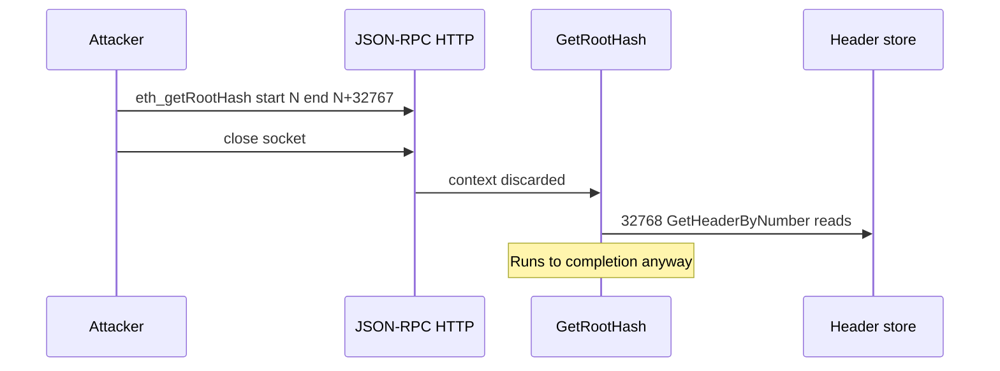
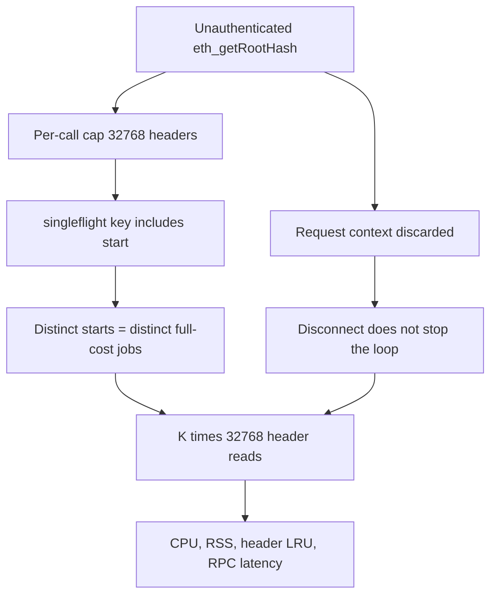

## What I found

Polygon Bor exposes `eth_getRootHash` (and `bor_getRootHash`) on the ordinary, unauthenticated JSON-RPC surface. One legal call can ask for up to **32,768** blocks. The node resolves that many canonical headers, builds a Merkle root, and holds the range in memory.

`EthAPIBackend.GetRootHash` takes a `context.Context` and **discards it** (`_ context.Context`). A client that writes the request and closes the socket pays almost nothing. The node still runs the computation to completion. Singleflight keys on `(start, end, endHash)`, so shifting `start` bypasses sharing. There is no auth, no per-caller throttle, and no cap on concurrent distinct computations.

Every current Polygon height is far above 32,768, so the maximum legal range is always available. Medium: denial of service of RPC / CPU / memory / header-store, not consensus or funds.



## How the work bound fails

Both `eth` (`BlockChainAPI`) and `bor` (`BorAPI`) register `GetRootHash` in `GetAPIs` with no authentication. The backend:

```go
func (b *EthAPIBackend) GetRootHash(_ context.Context, starBlockNr uint64, endBlockNr uint64) (string, error) {
```

Validation is only `start ≤ end`, `end ≤ head`, and `end-start+1 ≤ MaxCheckpointLength` (`2^15 = 32768`). Then a singleflight group keyed by `getRootHashKey(start, end)+"-"+endHash`. Two requests that differ only in `start` never share work.

The body allocates an L-entry header slice and one goroutine per height, gated by a 20-slot semaphore, each calling `GetHeaderByNumber` → canonical hash + header lookup. Nothing in the loop observes cancellation. `singleflight.Do` finishes even after every caller is gone.



The range cap and the 20-slot semaphore bound a *single* in-flight call. They do not bound aggregate work, and they do not give the client a way to stop paying.

## Attack shape

1. Read `eth_blockNumber` (same unauthenticated endpoint).
2. Open K connections. Each sends `eth_getRootHash` with a distinct legal range (`start` shifted so singleflight never hits). Close every socket after the write.
3. The node performs K × 32,768 canonical/header reads (20 concurrent per job). Disconnection does not cancel them.
4. Repeat. CPU, memory, and header-store load stay at an attacker-chosen level; unrelated RPC latency climbs.

Attacker cost per request: one small write and a close. No fee, no stake, no response body.

Confirmed on stock Bor `v2.10.1` (`7938b8afd281ed9e88729a349a3d401ed3dce4ce`) over real HTTP, plus a max-range measurement through the production API stack:

- 40 fire-and-forget max-range requests retained about 110 MiB of allocations at the API layer (~2.75 MiB per request), before DB/header-LRU cost on a live node.
- Unrelated `rpc_modules` went from 1 ms baseline to 86 ms during the burst and 382 ms after.
- On a mining validator, a 90 s canceled stream at **1/128** of the max range grew goroutines ~90 → 958 and RSS 149 MiB → 184 MiB.

## Impact

Medium on Polygon’s impact × probability table: DoS of node RPC/CPU/memory/header-store, high probability wherever the `eth` or `bor` HTTP namespace is exposed. Effects last for as long as the stream runs and recover when it stops. No durable state change, no consensus effect, no fund/fee impact.

The method’s public exposure is an operator choice. This writeup does not name a live endpoint and did not probe one.

## Fix

1. Honor the request context: abort header fetch and Merkle work on cancel/timeout.
2. Drop `start` from the singleflight key or otherwise share overlapping range work.
3. Authenticate, rate-limit, or cap concurrent distinct `GetRootHash` computations on the public path.

The existing `MaxCheckpointLength` and 20-slot semaphore should stay as a per-call ceiling, not as the only bound.

## What this is not

Not a consensus bug, not a reorg, not a fee/fund issue. Not “the 32,768 cap already mitigates this” — the cap is per request, singleflight is per `start`, and cancellation is a no-op. Distinct from the correctness hardening that bound `endHash` and detected in-flight reorgs. Those do not create a work budget or a back-pressure channel to the caller.
