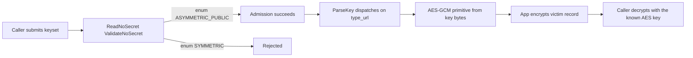
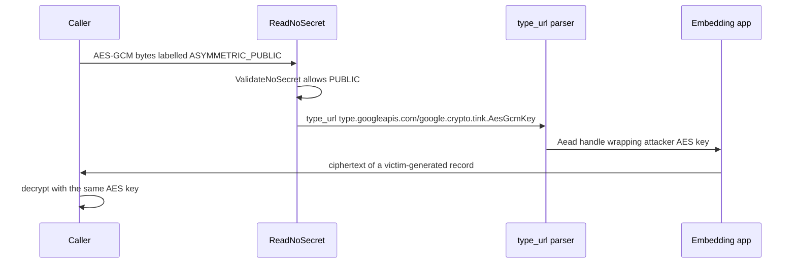

## What I found

At Tink C++ `24be9ed1c12785d7fd836a0bdd41644b9eed6c74` (`v2.8.0-109-g24be9ed1`), `KeysetHandle::ReadNoSecret()` accepts an AES-GCM keyset when the caller labels the material `ASYMMETRIC_PUBLIC`, even though the type URL and serialized value are a symmetric AES key.

The no-secret gate checks the caller-controlled **enum**. Parsing and primitive construction follow the independently supplied **type URL and bytes**. An application that imports a “public / no local secret” keyset and encrypts with the resulting `Aead` is therefore encrypting under a key the caller already knows.

The same AES key honestly labelled `SYMMETRIC` is rejected. This is not a break of AES-GCM; it is `CWE-1287` (improper validation of specified type) at the no-secret boundary.

## How admission and use disagree

`ReadNoSecret()` parses the keyset and calls `ValidateNoSecret()`. That helper rejects `UNKNOWN_KEYMATERIAL`, `SYMMETRIC`, and `ASYMMETRIC_PRIVATE`. It permits `ASYMMETRIC_PUBLIC` and `REMOTE`.

Downstream, `CreateEntry()` / `ToProtoKeySerialization()` keep type URL, value, and material type as separate fields. `ParseKeyWithLegacyFallback()` dispatches from `type_url`. AES-GCM `ParseKey()` checks syntax, version, key size, prefix, and secret access — not whether the declared material type matches AES-GCM secret material. `GetPrimitive()` then builds AES from the type URL and value without comparing against `AesGcmKeyManager::key_material_type()`. The wrapper encrypts with that key.

The failed invariant: a constructor that promises **no secret material** must derive or verify the material class from the selected parser or key manager. Admission trusts one caller-controlled discriminator; use trusts the others.

## Attack shape

1. An application exposes a public-only or KMS-backed import path and relies on `ReadNoSecret()` to keep local secrets out.
2. After import it calls `GetPrimitive<Aead>()` and encrypts application-owned records.
3. An external caller submits a complete serialized keyset: valid AES-GCM bytes, type URL for AES-GCM, material enum `ASYMMETRIC_PUBLIC`, plus key ID / primary / status / prefix.
4. The application encrypts a new record. The caller decrypts the ciphertext with the AES key they planted.

No host, KMS, registry, or maintainer access is required. Tink is a library: impact needs an embedding app that both accepts imported no-secret keysets and encrypts victim-relevant data under the handle.

The target-native PoC recovered a victim-generated 68-byte record under the global AEAD config and under `ConfigAead2026` (96-byte ciphertexts). A legitimate `REMOTE` KMS keyset still reaches encryption and cannot be decrypted with the attacker AES key. Honest `SYMMETRIC` labelling of the same AES entry is rejected.

## Impact

Technical severity is **High** for exposed import-and-encrypt integrations. The protected asset is data the application encrypts after import. The observed delta is 0 bytes recovered on the remote-key baseline versus full recovery of the victim record on the relabelled-AES path.

Blast radius is that workflow only. Applications that never import caller keysets, or that only encrypt caller-owned data, are outside the demonstrated impact. `tink-cc` is listed `TIER_OT0` / `SCOPE_OSS_VRP`; whether the downstream import topology is treated as a Tink defect or an integration prerequisite is a program decision. The root cause is in Tink’s no-secret gate.

Only the pinned commit was executed. The same denylist appears in source from v2.0.0 through v2.8.0; that earlier range is inference, not a tested claim.

## Fix

Bind material type to the concrete parser / key manager: reject AES-GCM (and any secret primitive) unless the declared material is `SYMMETRIC`, and reject a public label unless the selected type is actually public. Rotate imported handles and re-encrypt data processed under affected keys.

Do not treat `CleartextKeysetHandle` as the issue — that API is intentionally separate and is not on this path.

## What this is not

Not a cryptographic break of AES-GCM. Not algorithm confusion in the AEAD wrapper. Not KMS compromise, registry mutation, RCE, or memory corruption. Not “the app chose a bad keyset, so Tink is fine” — `ReadNoSecret()` is the public API for public or envelope keysets, and it already rejects the identical AES entry when labelled honestly.
